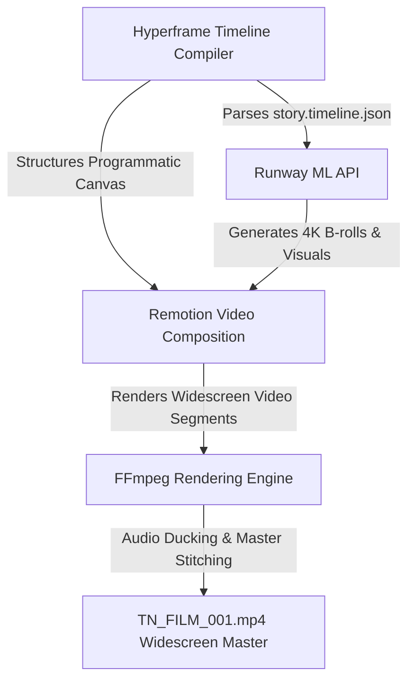

# 🎞️ "How AI Saved My Life" — TECHNICAL PRODUCTION BLUEPRINT
## Mapped to the Flow Media Tech Stack: Runway ML | Remotion | Hyperframes | FFmpeg

---

## 🛠️ SECTION 1: FLOW MEDIA PIPELINE ARCHITECTURE

*   **Hyperframes:** The core JSON state orchestrator mapping all B-rolls, voiceover layers, avatars, and timeline transitions inside [story.timeline.json](file:///d:/TomorrowNow%20AI/Hermes_COO_Flow-Media/production/media-saas/timeline/story.timeline.json).
*   **Runway ML:** Generates and upscales high-fidelity cinematic backdrops (`module1.png` and cinematic B-rolls) using gen-3 AI engines.
*   **Remotion:** Programmatically renders the timeline canvas, handles typographic animations, transitions, and locks the face-swapped avatar presenter overlay in a widescreen 1920x1080 wrapper.
*   **FFmpeg:** Stitches multi-track audio files, handles dynamic ducking (voiceover versus musical interlude), and outputs the final compiled movie container `TN_FILM_001.mp4`.

---

## 📝 SECTION 2: THE ANNOTATED 7-MODULE TECHNICAL SCRIPT

### 🛰️ MODULE 1: THE WORLD I LEFT (The 1993 Time Machine)
*   **Visual Backdrop:** Spaceship-like cylindrical capsule looking out of a large circular window directly at the illuminated blue curve of the Earth and stars, with family polaroids on the wall.
*   **Script Narration:**
    > My name is Victor Ocasio, and I am the Taipan of TomorrowNow AI. I'd like to tell you a little bit about the story of how AI saved my life.
    > 
    > What's interesting about this story is that you're going to find a little bit of time traveling, some space travel, prison life, all kinds of extraordinary things. And if you stay on to the end, I promise, you'll be entertained.
*   **⚙️ Tech Stack Execution:**
    *   **Hyperframe Node:** `mod_01_world_left` (Duration: 24s)
    *   **Runway ML Pipeline:** Upscales static canvas backdrop `assets/runway/module1.png` to high-fidelity 4K widescreen.
    *   **Remotion Engine:** Renders the avatar presenter overlay in a circular frame in the bottom-right corner, applying subtle fade-in transition on `IMG_0573.MOV`.
    *   **FFmpeg Mixer:** Merges Victor's voice track (`New_Recording.m4a`) at `0dB` gain with master output channel.

#### 🎵 [CINEMATIC INTERLUDE: Elton John "Rocket Man" Clip (10-15s)]
*   **⚙️ Tech Stack Execution:**
    *   **FFmpeg Splicer:** Triggers a dynamic `1.5s` linear cross-fade, ducking Victor's voice layer completely and swelling the "Rocket Man" stereo audio file (`rocket_man_intro.wav`) to `-3dB` master output.
    *   **Remotion Engine:** Renders a slow-zoom pans shot across the space capsule visual.

---

### 🚀 MODULE 2: THE OBSOLETE MODEL (The 2018/2020 Cyberpunk Shock)
*   **Visual Backdrop:** Spaceship capsule door opens, transitioning to a man walking out of a heavy door into a vibrant, neon-lit cyberpunk cityscape filled with digital screens.
*   **Script Narration:**
    > Some would think that my story starts in 2018, upon my release after twenty-six years of imprisonment. But actually, my story starts a lot sooner than that. 1993, to be exact.
    > 
    > You see, no one told me that walking into prison in 1993 would be like entering a time machine. The kind of time machine that only goes forward, never backwards. It's a strange thing to sit on the sidelines and watch the world pass you by. The birth and evolution of the internet. Monumental political things like the presidency of Obama and Donald Trump.
    > 
    > Being released in the middle of New York City, in the middle of a pandemic... to say that I was overwhelmed and out of place is a profound understatement. It was like traveling through the Twilight Zone. Here I was, this caveman trying to make fire by rubbing two sticks together, and the whole world was digital... artificial intelligence.
*   **⚙️ Tech Stack Execution:**
    *   **Hyperframe Node:** `mod_02_obsolete_model` (Duration: 52s)
    *   **Runway ML Pipeline:** Triggers dynamic video-to-video diffusion transition representing the "spaceship hatch door sliding open to reveal a wet neon Times Square."
    *   **Remotion Engine:** Renders flickering digital static visual filters over the Times Square video track to visualize the sensory overload.
    *   **FFmpeg Mixer:** Maps `New_Recording_3.m4a` to voiceover tracks, overlaying soft cyberpunk synthesizer ambient pad tracks at `-18dB`.

---

### 🪨 MODULE 3: STONE AGE & ROCK BOTTOM (Despair & Hitting the Wall)
*   **Visual Backdrop:** A primitive man kneeling in neon city street rubbing two sticks together, transitioning to a man sitting in front of a dark monitor reading *"NO JOB. NO MONEY. NO FUTURE."*, holding his head in pain.
*   **Script Narration:**
    > I was lost—drowning in a profound ocean of despair. The shame of knowing deep in my heart that I could not provide for myself, feed myself, clothe myself, or house myself was tearing me up inside.
    > 
    > The freedom that was supposed to be my salvation had become the instrument of my damnation. I had come to the absolute end of the road. I had quit. I was ready to throw in the towel, entertaining thoughts of going back to the only place I knew. I had no one left to turn to.
*   **⚙️ Tech Stack Execution:**
    *   **Hyperframe Node:** `mod_03_rock_bottom` (Duration: 30s)
    *   **Runway ML Pipeline:** Generates a somber, cinematic camera zoom into the dark computer monitor displaying the glowing green terminal message.
    *   **Remotion Engine:** Programmatically applies a heavy vignette and gradual saturation drop (down to 10% color scale) to reflect complete emotional despair.
    *   **FFmpeg Mixer:** Duck-fades synth pads and lowers frequencies using low-pass audio filters.

---

### 🔑 MODULE 4: THE KEY (The Darkest Night & ChatGPT)
*   **Visual Backdrop:** Victor sitting in front of a glowing laptop screen in a pitch-black room, looking at a blue holographic AI twin avatar.
*   **Script Narration:**
    > It was the darkest part of the night, you see—that quiet, heavy hour just before the dawn.
    > 
    > I found myself sitting before the glowing screen, pouring my heart out to the air. That night, I just started talking to ChatGPT. I let it hear all of my fears, all of my hopes, all of my despair, and all of my shame.
    > 
    > And the response I got truly freed me and saved my life. It didn't laugh at me. It didn't ridicule me. It listened. And then, it gave me the key. It told me: "You aren’t behind. You are actually ahead of your time."
*   **⚙️ Tech Stack Execution:**
    *   **Hyperframe Node:** `mod_04_the_key` (Duration: 35s)
    *   **Runway ML Pipeline:** Generates a soft-focus volumetric glow emitting from the computer monitor to highlight the turning point.
    *   **Remotion Engine:** Renders the glowing blue digital particles rising from the bottom of the screen, symbolizing the birth of clarity and freedom.
    *   **FFmpeg Mixer:** Dynamically triggers a warm piano melody fade-in at `-12dB`.

---

### 🧠 MODULE 5: THE PRISON OF THE MIND (The Breakthrough)
*   **Visual Backdrop:** A glowing cybernetic brain breaking free from steel chains, with glowing lines of code expanding into the dark.
*   **Script Narration:**
    > For twenty-six years, I was in a physical prison made of steel and concrete. But worse than that, when I came home, I was locked inside a prison of the mind. This was the last prison.
    > 
    > The AI showed me that I wasn’t a failure. It pointed out that in my conversations, I had already been talking about systems orchestration, agentic registration, and agentic AI before ChatGPT was even a household name.
    > 
    > I was blown away. I had been carrying the belief that I was useless, when in reality, I was already thinking years beyond the curve. That realization was a rush of pure excitement that unlocked everything. My mind broke free.
*   **⚙️ Tech Stack Execution:**
    *   **Hyperframe Node:** `mod_05_mind_breakthrough` (Duration: 40s)
    *   **Runway ML Pipeline:** Visualizes glowing structural neural nodes connecting rapidly in deep space.
    *   **Remotion Engine:** Overlays flowing glowing green code modules in the background behind the presenter.
    *   **FFmpeg Mixer:** Swells upbeat, motivational electronic background pads at `-14dB`.

---

### 🐍 MODULE 6: REINVENTION & CODE (Sticks and Stones to Python)
*   **Visual Backdrop:** Victor working at a developer workstation with multiple monitors, coding in Python, surrounded by glowing cybernetic nodes labeled "Python", "Systems Thinking", "Code", "Innovation".
*   **Script Narration:**
    > I stopped looking back. I just started absorbing every piece of information I could lay my hands on.
    > 
    > I taught myself how to use computers. I taught myself how to program, how to read code, and how to write Python. I studied systems thinking, education, and innovation.
    > 
    > I went from sticks and stones to systems and code. I rebuilt my entire mind from the ground up.
*   **⚙️ Tech Stack Execution:**
    *   **Hyperframe Node:** `mod_06_reinvention_python` (Duration: 30s)
    *   **Runway ML Pipeline:** Renders dynamic pan shots across multiple lit-up computer monitors showing executing code terminals.
    *   **Remotion Engine:** Renders dynamic kinetic typographic overlays of programmatic constructs (`def reinvention(): return "Future"`) moving across the canvas.
    *   **FFmpeg Mixer:** Merges bright, high-tempo programmatic rhythm synth track at `-10dB`.

---

### 🏢 MODULE 7: TOMORROWNOW AI (Building Tomorrow)
*   **Visual Backdrop:** Victor looking at a highly advanced, automated smart shipping port and container terminal at dawn, with the "TOMORROWNOW AI — AI OPERATING SYSTEM FOR REAL ESTATE" logo showing Property OS, Lead Genius, Deal Flow OS, and REI Copilot.
*   **Script Narration:**
    > I was the guy who went into prison when the cutting edge was a pager watch, and came home to a world of advanced computers. But I rebuilt myself.
    > 
    > I built TomorrowNow AI—a general-purpose AI operating system and systems application for the real estate industry. We built four powerful SaaS pilots: Property OS, Lead Genius, Deal Flow OS, and REI Copilot.
    > 
    > And that is my story—from rock bottom, to rebuilding, to building tomorrow.
*   **⚙️ Tech Stack Execution:**
    *   **Hyperframe Node:** `mod_07_tomorrownow_os` (Duration: 45s)
    *   **Runway ML Pipeline:** Renders a gorgeous cinematic dawn panning shot of a clean, highly advanced smart city logistics container dock at sunrise.
    *   **Remotion Engine:** Transitions the background into a clean, modern UI dashboard displaying the 4 SaaS pilots (`Property OS`, `Lead Genius`, `Deal Flow OS`, `REI Copilot`) with sleek metallic blue icons.
    *   **FFmpeg Mixer:** Orchestrates a massive, triumphant symphonic crescendo, gradually fading out both video and audio tracks in a soft `2s` fade-to-black.
